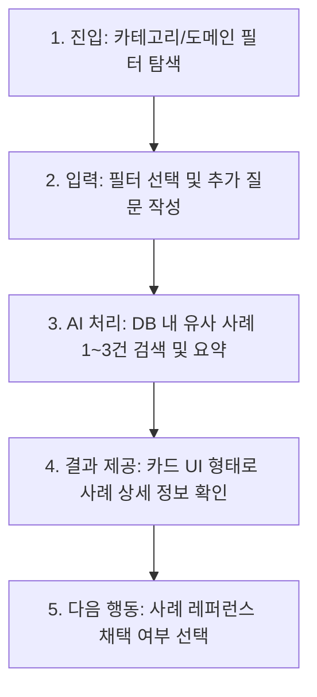

# 제품 요구사항 정의서 (PRD) - Casebook

## 1. 제품 개요 (Overview)

### 1.1 한 줄 정의
사수나 동료가 없는 1년차 미만 UI/UX 디자이너(취업 준비생 포함)가 자신의 디자인 결정에 확신을 얻지 못하고 GPT, 핀터레스트, 구글 재검색을 반복하는 문제를 해결하기 위해, **동일하거나 유사한 맥락의 실제 제품 사례(문제 → 상황 → 결정 → 결과)를 제공하여 교차검증을 돕고 탐색 시간을 단축시켜 주는 웹 서비스**입니다.

### 1.2 타깃 사용자 (Target Audience)
*   사수 및 동료가 없는 1년차 미만 주니어 UI/UX 디자이너
*   디자인 포트폴리오를 준비 중인 취업 준비생

### 1.3 문제 정의 (Problem Statement)
*   디자인 의사결정을 내릴 때, 본인이 직면한 문제와 유사한 상황에서 다른 서비스가 어떻게 해결했는지(결정과 그 결과)에 대한 실제 사례 데이터가 부족합니다.
*   이로 인해 자신의 결정에 확신을 갖지 못하고, 다양한 플랫폼(GPT, 구글, 레퍼런스 사이트)에서 재검색을 반복하며 많은 시간을 낭비합니다.

### 1.4 핵심 가설 (Hypothesis)
*   **"사용자가 직면한 문제 상황과 유사한 실제 서비스의 해결 사례와 결과(성공/실패)를 함께 제시한다면, 디자이너는 재검색을 멈추고 의사결정 탐색 시간을 크게 줄일 수 있을 것이다."**

---

## 2. 핵심 사용자 시나리오 (User Journey)

1.  **진입**: 사용자가 웹 서비스에 접속하면 예시 문제 카테고리와 도메인 필터가 보여집니다.
2.  **입력**: 사용자는 해결하고자 하는 문제의 카테고리와 도메인을 선택하고, 구체적인 상황이나 고민(추가 질문)을 텍스트로 입력합니다. (예: "소셜 로그인만 붙일까?")
3.  **AI 처리**: AI는 입력된 카테고리, 도메인, 추가 질문을 분석하여 미리 구축된 데이터베이스(DB)에서 가장 유사한 실제 사례 1~3건(성공/실패 사례 포함)을 매칭 및 요약합니다.
4.  **결과**: 매칭된 유사 사례들을 핵심 정보(문제, 상황, 제약상황, 결정, 근거, 결과, 출처) 위주로 요약하여 카드 UI 형태로 사용자에게 보여줍니다.
5.  **다음 행동**: 사용자는 제공된 사례를 읽고, 자신의 의사결정에 참고가 되었는지 여부에 따라 `채택(채택할게요)` 또는 `비채택(더 찾아볼게요)` 버튼을 선택합니다.

---

## 3. 기능 범위 (Scope of Features)

### 3.1 Must Have (구현 범위)
1.  **사례 데이터베이스 (DB)**: 최소 1개 이상의 문제 카테고리와 이를 해결한 실제 제품 사례 **15~20건** 구축 (정적 JSON 데이터로 임베딩).
2.  **입력 및 필터 폼**: 문제 카테고리, 도메인 필터 선택 기능 및 50자 제한의 추가 질문 입력란.
3.  **답변 채택/비채택 기록 저장**: 사용자의 채택/비채택 피드백 기록을 브라우저에 저장 (LocalStorage 활용).
4.  **재방문 여부 체크**: 사용자의 재방문 여부를 확인하여 성과 지표 측정에 활용 (LocalStorage 활용).
5.  **채택 보관함**: 사용자가 `채택`한 사례들을 한눈에 모아볼 수 있는 화면 제공.

### 3.2 Won't Have (이번 버전에서 제외)
1.  사용자 로그인 및 회원가입 기능 (LocalStorage로 대체)
2.  다크모드 지원 (라이트 모드로 단일 UI 구현)
3.  모바일 반응형 최적화 (PC/태블릿 환경 우선 대응)

---

## 4. 화면 구성 및 UI 요구사항

### 4.1 화면 1: 진입 & 입력 (Home & Input)
*   **카테고리 선택 필터** (UX 라이팅: "어떤 부분의 문제를 해결하고 싶으신가요?")
    *   선택지: 가입, 인증/본인확인, 정보입력, 인트로, 결제, 홈, 정보구조
*   **도메인 선택 필터** (UX 라이팅: "해당하는 서비스 도메인은 어디인가요?")
    *   선택지: 핀테크, 커머스, 헬스케어, 글로벌, 콘텐츠, 에듀테크, B2B
*   **추가 질문 입력 박스** (UX 라이팅: "선택한 카테고리에서 해결하고 싶은 문제를 구체적으로 작성해 주세요.")
    *   Placeholder: "예: 소셜 로그인만 추가할 때 단계 구성은 어떻게 할까?"
    *   글자수 제한: 공백 포함 최대 50자

### 4.2 화면 2: 결과 제공 (Result)
*   **검색 결과 안내 텍스트**: "비슷한 문제를 해결한 실제 사례 `N`건을 찾았어요."
*   **매칭 사례 카드 UI** (사례당 1개 카드 구성):
    *   제목, 회사명, 도메인, 문제 상황
    *   상황/제약, 결정사항, 결정 근거, 결과 (성공 또는 실패)
    *   날짜, 출처 링크 (아웃링크 버튼 UI)
*   **채택 여부 확인 및 피드백 버튼**:
    *   안내 문구: "이 사례를 레퍼런스로 채택하시겠어요?"
    *   버튼 1: **"채택할게요"** (클릭 시 채택 보관함에 저장 및 기록)
    *   버튼 2: **"더 찾아볼게요"** (클릭 시 비채택 기록 및 재검색 유도)

### 4.3 화면 3: 채택한 사례 보관함 (Saved Reference)
*   사용자가 `채택할게요`를 선택한 사례들을 카드 리스트 형태로 모아보는 화면.
*   **카드 UI 구성 요소**:
    *   제목, 회사명, 도메인, 문제 상황, 결정사항, 결과, 날짜, 출처 링크 버튼

---

## 5. AI 동작 및 데이터 연동 정의

### 5.1 입력 제약 조건
*   유저의 추가 질문 입력값: 공백 포함 최대 **50자** 제한.

### 5.2 AI 요약 및 매칭 규칙
*   사용자가 입력한 필터(카테고리, 도메인)와 추가 질문 키워드를 기반으로 DB에서 가장 적절한 사례를 탐색합니다.
*   사례 카드에 노출되는 각 텍스트 항목(문제, 상황, 결정, 근거, 결과 등)은 유저 가독성을 위해 **각 항목당 최대 100자 이내**로 요약 및 제한하여 출력합니다.
*   **톤앤매너**: 주니어 디자이너가 이해하기 쉽고 친절한 용어로 서술합니다.
*   **예외 처리**: 매칭되는 사례가 DB에 없을 경우 아래의 에러 메시지를 표시합니다.
    *   실패 메시지: `"비슷한 실제 사례를 찾지 못했어요."`

---

## 6. 성과 지표 (Metrics)

| 지표명 | 정의 | 측정 목적 |
| :--- | :--- | :--- |
| **답변 채택율** | `채택 수 / 전체 검색 시도 수` | 제공된 실제 사례가 유저의 의사결정에 유용한 교차검증 수단이 되었는지 측정 |
| **재방문율** | `1회 이상 재방문한 유저 수 / 전체 유저 수` | 본 서비스가 유저의 재검색 반복 문제를 실제로 해결하고 지속적인 가치를 주는지 측정 |

---

## 7. 기술 스택 (Tech Stack)

*   **저장 위치**: `/Users/idahuin/Desktop/casebook/src`
*   **프론트엔드**: Vanilla HTML, CSS, JavaScript (Vite 번들러 사용 권장)
*   **데이터베이스 (DB)**: 제공되는 CSV 파일을 분석하여 `cases.json` 형태의 정적 JSON 데이터로 변환 후 프로젝트 내에 포함하여 사용.
*   **AI Engine**: Gemini API (Firebase AI Logic 또는 직접 연동)를 사용하여 유저의 질문과 DB의 사례 간 유사도를 매칭하고 요약하는 용도로 사용.

---

## 8. 개발 마일스톤 (Milestones)

*   **M1: 프로토타입 구현 (더미 데이터 기반)**
    *   기본 UI 컴포넌트(입력 폼, 결과 카드, 보관함) 퍼블리싱
    *   정적 JSON DB 구축 및 더미 매칭 로직으로 화면 흐름 검증
*   **M2: AI 연동 & 기능 고도화**
    *   Gemini API 연동하여 사용자 질문에 가장 잘 매칭되는 사례를 찾아 요약 및 출력
    *   LocalStorage를 이용한 채택/비채택 데이터 및 재방문 로그 기록 기능 구현
*   **M3: 배포 및 검증**
    *   웹 서비스 배포 (Firebase Hosting 등 활용)
    *   최종 사용자 인수 테스트 및 피드백 반영
